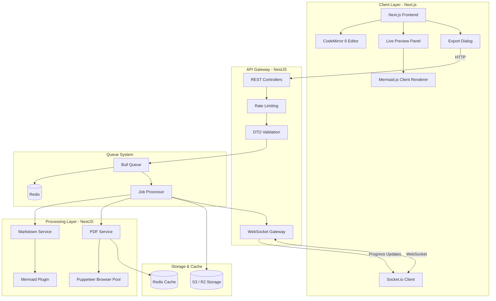
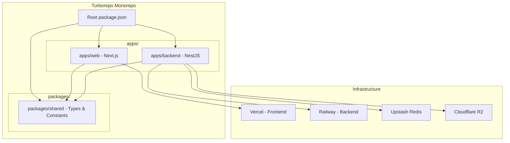
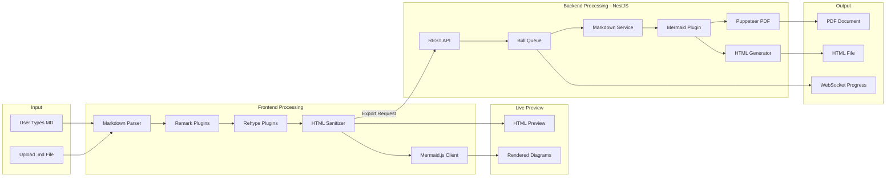
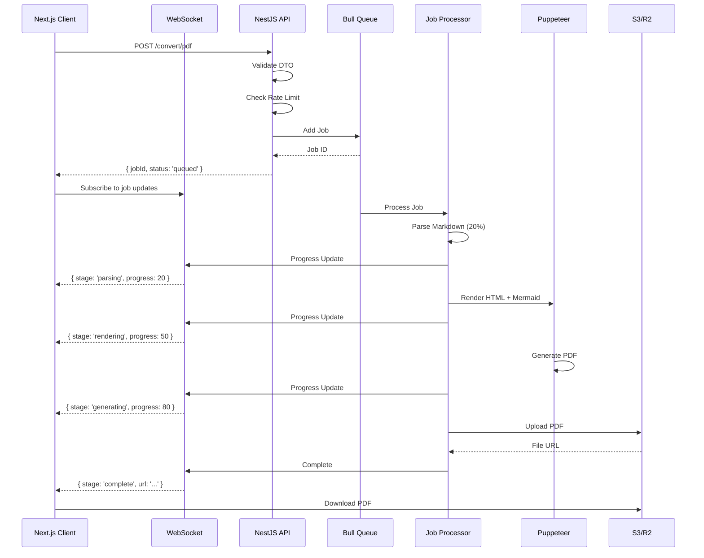
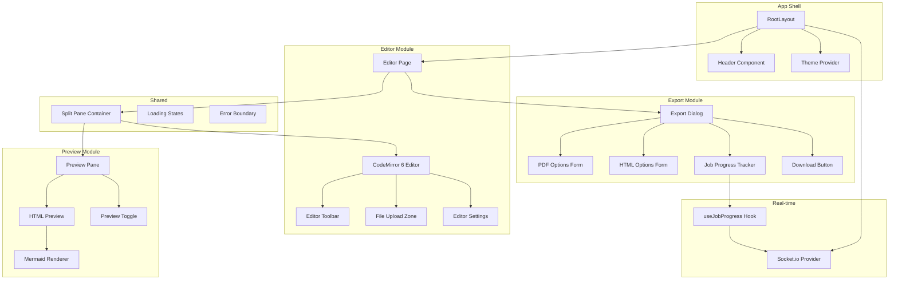
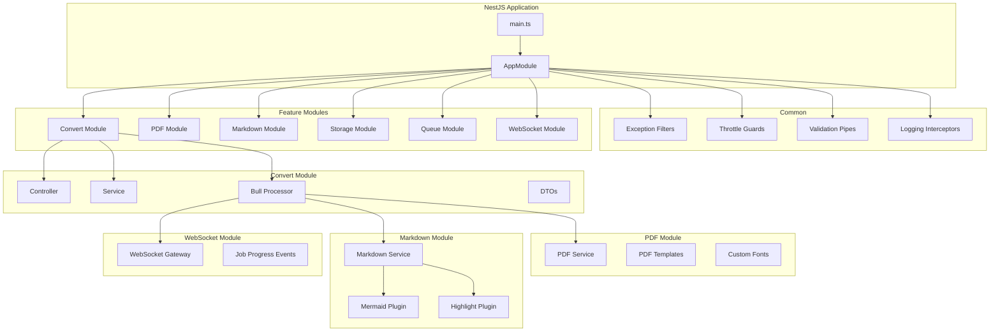
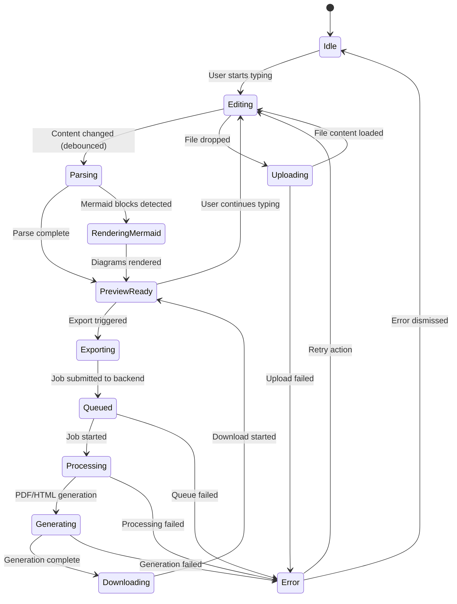
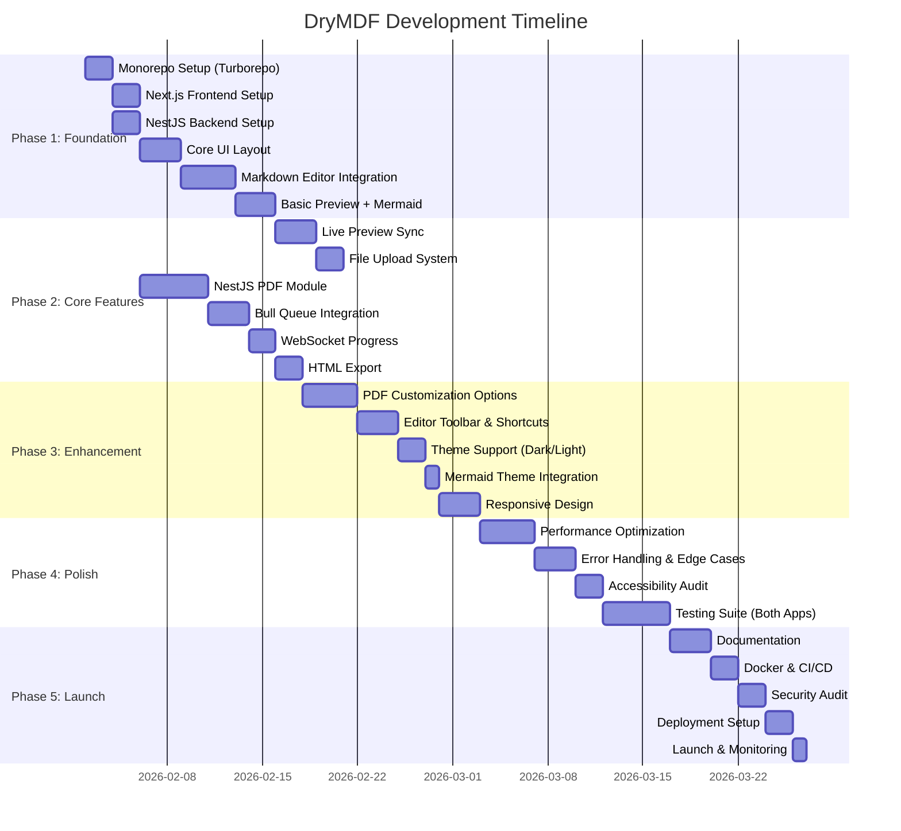
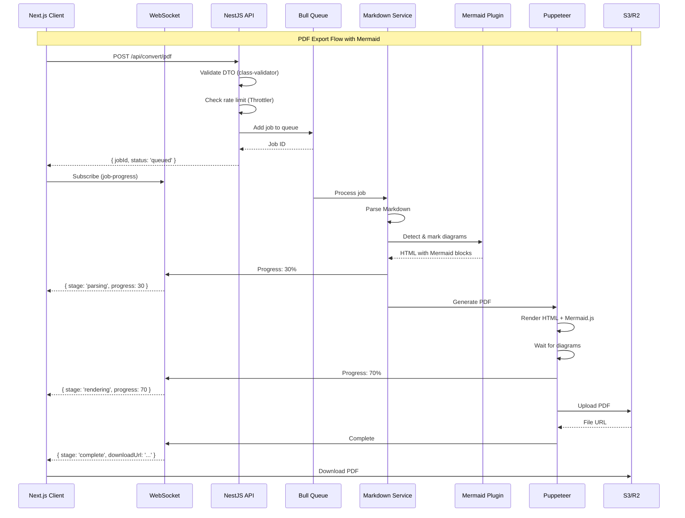

# DryMDF Web Application - Project Plan

## Executive Summary

This document outlines the comprehensive development plan for building a production-ready, open-source Markdown to PDF converter web application. The application will enable users to write, edit, preview, and export Markdown documents to PDF and HTML formats.

---

## System Architecture



---

## Monorepo Structure



---

## Data Flow Diagram



---

## Real-time Job Processing Flow



---

## Component Architecture



---

## NestJS Backend Architecture



---

## State Management Flow



---

## Development Phases



---

## Phase 1: Foundation (16 days)

### 1.1 Monorepo Setup (2 days)

**Tasks:**

- [ ] Initialize Turborepo monorepo structure
- [ ] Configure pnpm workspaces
- [ ] Set up shared TypeScript config
- [ ] Configure ESLint and Prettier for monorepo
- [ ] Set up Husky for commit hooks
- [ ] Create shared packages structure

**Commands:**

```bash
npx create-turbo@latest drymdf
cd drymdf
pnpm install
```

**Deliverables:**

- Working Turborepo monorepo
- Shared configuration
- pnpm workspace setup

### 1.2 Next.js Frontend Setup (2 days)

**Tasks:**

- [ ] Initialize Next.js 14 in apps/web
- [ ] Configure Tailwind CSS and shadcn/ui
- [ ] Set up path aliases
- [ ] Configure environment variables
- [ ] Create base layout structure

**Commands:**

```bash
cd apps/web
npx create-next-app@latest . --typescript --tailwind --eslint --app --src-dir
npx shadcn@latest init
pnpm add zustand zod @tanstack/react-query mermaid socket.io-client
```

### 1.3 NestJS Backend Setup (2 days)

**Tasks:**

- [ ] Initialize NestJS in apps/backend
- [ ] Configure TypeScript strict mode
- [ ] Set up configuration module
- [ ] Configure Swagger/OpenAPI
- [ ] Set up health check endpoint
- [ ] Configure CORS for frontend

**Commands:**

```bash
cd apps/backend
nest new . --package-manager pnpm
pnpm add @nestjs/config @nestjs/swagger @nestjs/throttler
pnpm add @nestjs/bull bull ioredis
pnpm add puppeteer class-validator class-transformer
pnpm add @nestjs/platform-socket.io socket.io
```

**Deliverables:**

- Working NestJS application
- Swagger documentation at /api
- Health check endpoint

### 1.4 Core UI Layout (3 days)

**Tasks:**

- [ ] Create responsive app shell (Header, Main, Footer)
- [ ] Implement split-pane layout component
- [ ] Build resizable panel system
- [ ] Create theme provider (dark/light mode)
- [ ] Add Socket.io provider for real-time
- [ ] Add loading skeletons

### 1.5 Markdown Editor Integration (4 days)

**Tasks:**

- [ ] Integrate CodeMirror 6 editor
- [ ] Configure Markdown syntax highlighting
- [ ] Add line numbers and word count
- [ ] Implement auto-indentation
- [ ] Create editor state management (Zustand)
- [ ] Add localStorage auto-save

**Dependencies:**

```bash
pnpm add @codemirror/view @codemirror/state @codemirror/lang-markdown
pnpm add @codemirror/theme-one-dark @codemirror/commands
```

### 1.6 Basic Preview + Mermaid (3 days)

**Tasks:**

- [ ] Set up unified Markdown processing pipeline
- [ ] Integrate remark-gfm for GitHub Flavored Markdown
- [ ] Add syntax highlighting for code blocks
- [ ] Implement Mermaid client-side rendering
- [ ] Create MermaidRenderer component
- [ ] Handle Mermaid error states gracefully

**Dependencies:**

```bash
pnpm add unified remark-parse remark-gfm remark-rehype
pnpm add rehype-stringify rehype-sanitize rehype-highlight
pnpm add mermaid @tailwindcss/typography
```

**Mermaid Implementation:**

```typescript
// Detect mermaid code blocks and render client-side
const MermaidRenderer = ({ code }) => {
  useEffect(() => {
    mermaid.initialize({ startOnLoad: false, theme: "default" });
    mermaid.render("mermaid-" + id, code).then(({ svg }) => {
      container.innerHTML = svg;
    });
  }, [code]);
};
```

**Deliverables:**

- Real-time HTML preview
- Mermaid diagram rendering
- GFM support

---

## Phase 2: Core Features (17 days)

### 2.1 Live Preview Sync (3 days)

**Tasks:**

- [ ] Implement debounced preview updates (300ms)
- [ ] Add scroll synchronization between editor and preview
- [ ] Create preview loading states
- [ ] Handle large document performance
- [ ] Add preview refresh button

### 2.2 File Upload System (2 days)

**Tasks:**

- [ ] Create drag-and-drop upload zone
- [ ] Implement file type validation
- [ ] Add file size limits (5MB)
- [ ] Handle file reading and content loading
- [ ] Add upload progress indicator

### 2.3 NestJS PDF Module (5 days)

**Tasks:**

- [ ] Create PDF module structure
- [ ] Implement Puppeteer browser pool
- [ ] Create PDF service with Mermaid support
- [ ] Design PDF templates (base, minimal, professional)
- [ ] Add custom font support
- [ ] Implement page size and margin options
- [ ] Create header/footer templates

**NestJS Module Structure:**

```typescript
// apps/backend/src/modules/pdf/pdf.module.ts
@Module({
  providers: [PdfService],
  exports: [PdfService],
})
export class PdfModule {}
```

### 2.4 Bull Queue Integration (3 days)

**Tasks:**

- [ ] Set up Bull queue module
- [ ] Create convert processor
- [ ] Implement job progress tracking
- [ ] Add job status endpoint
- [ ] Configure Redis connection
- [ ] Add job cleanup for completed jobs

**Queue Configuration:**

```typescript
// apps/backend/src/modules/queue/queue.module.ts
@Module({
  imports: [
    BullModule.forRoot({
      redis: { host: "localhost", port: 6379 },
    }),
    BullModule.registerQueue({ name: "pdf-generation" }),
  ],
})
export class QueueModule {}
```

### 2.5 WebSocket Progress (2 days)

**Tasks:**

- [ ] Create WebSocket gateway
- [ ] Implement job progress events
- [ ] Create client-side socket hook
- [ ] Add progress UI component
- [ ] Handle reconnection logic

**WebSocket Gateway:**

```typescript
// apps/backend/src/modules/websocket/websocket.gateway.ts
@WebSocketGateway({ cors: true })
export class WebsocketGateway {
  @WebSocketServer() server: Server;

  sendProgress(clientId: string, data: JobProgress) {
    this.server.to(clientId).emit("job-progress", data);
  }
}
```

### 2.6 HTML Export (2 days)

**Tasks:**

- [ ] Create HTML export endpoint
- [ ] Generate self-contained HTML with embedded CSS
- [ ] Include Mermaid diagrams as SVG
- [ ] Add copy-to-clipboard functionality
- [ ] Implement download as .html file

**Deliverables:**

- Complete PDF generation pipeline
- Real-time progress updates
- HTML export functionality

---

## Phase 3: Enhancement (13 days)

### 3.1 PDF Customization Options (4 days)

**Tasks:**

- [ ] Build PDF options dialog
- [ ] Implement page size selector
- [ ] Add margin controls (top, right, bottom, left)
- [ ] Create font selection
- [ ] Add header/footer toggle and content
- [ ] Implement page numbering options
- [ ] Create PDF templates (minimal, professional, academic)

### 3.2 Editor Toolbar & Shortcuts (3 days)

**Tasks:**

- [ ] Build formatting toolbar (bold, italic, links, etc.)
- [ ] Implement keyboard shortcuts
- [ ] Add heading level selector
- [ ] Create list formatting buttons
- [ ] Add table insertion tool
- [ ] Add Mermaid diagram insertion button
- [ ] Add code block insertion with language selector

**Keyboard Shortcuts:**
| Action | Shortcut |
|--------|----------|
| Bold | Ctrl/Cmd + B |
| Italic | Ctrl/Cmd + I |
| Link | Ctrl/Cmd + K |
| Heading | Ctrl/Cmd + 1-6 |
| Save | Ctrl/Cmd + S |
| Export PDF | Ctrl/Cmd + Shift + P |

### 3.3 Theme Support (2 days)

**Tasks:**

- [ ] Implement dark/light mode toggle
- [ ] Create editor theme variants
- [ ] Add preview theme options
- [ ] Persist theme preference

### 3.4 Mermaid Theme Integration (1 day)

**Tasks:**

- [ ] Sync Mermaid theme with app theme
- [ ] Add Mermaid-specific theme options
- [ ] Implement theme switching for diagrams
- [ ] Test all diagram types in both themes

### 3.5 Responsive Design (3 days)

**Tasks:**

- [ ] Mobile layout (stacked panels)
- [ ] Tablet layout optimization
- [ ] Touch-friendly controls
- [ ] Mobile toolbar adaptation

**Deliverables:**

- Fully responsive application
- Theme-aware Mermaid diagrams
- Mobile-optimized experience

---

## Phase 4: Polish (14 days)

### 4.1 Performance Optimization (4 days)

**Tasks:**

- [ ] Implement virtual scrolling for large documents
- [ ] Add Web Worker for Markdown parsing
- [ ] Optimize bundle size (code splitting)
- [ ] Implement Puppeteer browser pool for NestJS
- [ ] Add PDF caching with Redis
- [ ] Optimize Mermaid rendering (lazy load)

**Performance Targets:**

- FCP < 1.5s
- TTI < 3s
- LCP < 2.5s
- PDF Generation < 5s

### 4.2 Error Handling & Edge Cases (3 days)

**Tasks:**

- [ ] Create error boundary components
- [ ] Handle network failures gracefully
- [ ] Add retry mechanisms for failed jobs
- [ ] Handle WebSocket disconnection
- [ ] Add informative error messages
- [ ] Handle Mermaid syntax errors gracefully

### 4.3 Accessibility Audit (2 days)

**Tasks:**

- [ ] Add ARIA labels to all interactive elements
- [ ] Implement keyboard navigation
- [ ] Ensure focus management
- [ ] Verify color contrast (WCAG 2.1 AA)

### 4.4 Testing Suite (5 days)

**Tasks:**

- [ ] Frontend unit tests (Vitest)
- [ ] Frontend component tests (Testing Library)
- [ ] Backend unit tests (Jest)
- [ ] Backend integration tests
- [ ] E2E tests (Playwright)
- [ ] Set up CI pipeline

**Test Structure:**

```
apps/
├── web/
│   └── tests/
│       ├── unit/
│       ├── integration/
│       └── e2e/
└── api/
    └── test/
        ├── unit/
        ├── integration/
        └── e2e/
```

**Deliverables:**

- 80%+ code coverage
- CI/CD integration
- Automated testing

---

## Phase 5: Launch (10 days)

### 5.1 Documentation (3 days)

**Tasks:**

- [ ] Write comprehensive README
- [ ] Create API documentation (Swagger)
- [ ] Add inline code documentation (JSDoc/TSDoc)
- [ ] Write contributing guidelines
- [ ] Create deployment guide

**Documentation Structure:**

```
docs/
├── README.md
├── API.md               # Auto-generated from Swagger
├── CONTRIBUTING.md
├── DEVELOPMENT.md
├── DEPLOYMENT.md
└── USER_GUIDE.md
```

### 5.2 Docker & CI/CD (2 days)

**Tasks:**

- [ ] Create Dockerfile for frontend
- [ ] Create Dockerfile for backend
- [ ] Set up docker-compose for local development
- [ ] Create GitHub Actions workflows
- [ ] Set up automatic deployments

**Docker Setup:**

```yaml
# docker-compose.yml
services:
  web:
    build: ./apps/web
    ports: ["3000:3000"]
  api:
    build: ./apps/backend
    ports: ["4000:4000"]
  redis:
    image: redis:alpine
    ports: ["6379:6379"]
```

### 5.3 Security Audit (2 days)

**Tasks:**

- [ ] Review input sanitization
- [ ] Verify rate limiting effectiveness
- [ ] Check for XSS vulnerabilities
- [ ] Review Content Security Policy
- [ ] Scan dependencies (npm audit)
- [ ] Configure security headers

### 5.4 Deployment Setup (2 days)

**Tasks:**

- [ ] Deploy frontend to Vercel
- [ ] Deploy backend to Railway/Render
- [ ] Set up Redis on Upstash
- [ ] Configure S3/R2 for storage
- [ ] Set up Sentry for error tracking
- [ ] Configure custom domains

**Environment Variables:**

```env
# Frontend (.env)
NEXT_PUBLIC_API_URL=https://api.drymdf.com
NEXT_PUBLIC_WS_URL=wss://api.drymdf.com

# Backend (.env)
REDIS_URL=redis://...
AWS_S3_BUCKET=drymdf-files
CORS_ORIGIN=https://drymdf.com
```

### 5.5 Launch & Monitoring (1 day)

**Tasks:**

- [ ] Final production testing
- [ ] Deploy to production
- [ ] Monitor initial traffic
- [ ] Set up alerts
- [ ] Announce launch

**Deliverables:**

- Live production application
- Monitoring dashboards
- Launch announcement

---

## API Endpoints



### Endpoint Specifications

| Endpoint                  | Method | Description              | Rate Limit |
| ------------------------- | ------ | ------------------------ | ---------- |
| `/api/convert/pdf`        | POST   | Queue PDF conversion job | 10/min     |
| `/api/convert/pdf/:jobId` | GET    | Get job status/result    | 60/min     |
| `/api/convert/html`       | POST   | Convert MD to HTML       | 20/min     |
| `/api/upload`             | POST   | Upload .md file          | 5/min      |
| `/api/health`             | GET    | Health check             | None       |
| `/socket.io`              | WS     | Real-time job progress   | N/A        |

### NestJS DTO Examples

```typescript
// apps/backend/src/modules/convert/dto/convert-pdf.dto.ts
import { IsString, IsOptional, ValidateNested, IsEnum } from "class-validator";
import { Type } from "class-transformer";

class MarginsDto {
  @IsOptional() top?: string;
  @IsOptional() right?: string;
  @IsOptional() bottom?: string;
  @IsOptional() left?: string;
}

class PdfOptionsDto {
  @IsEnum(["a4", "letter", "legal"])
  @IsOptional()
  format?: "a4" | "letter" | "legal";

  @ValidateNested()
  @Type(() => MarginsDto)
  @IsOptional()
  margins?: MarginsDto;

  @IsOptional()
  showHeaderFooter?: boolean;
}

export class ConvertPdfDto {
  @IsString()
  markdown: string;

  @IsString()
  clientId: string;

  @ValidateNested()
  @Type(() => PdfOptionsDto)
  @IsOptional()
  options?: PdfOptionsDto;
}
```

---

## Technology Decisions

### Why Separate NestJS Backend?

- PDF generation is CPU-intensive → offload from Next.js
- Independent scaling of PDF service
- Bull queues for async processing with progress
- WebSocket support for real-time status
- Better separation of concerns
- Easier to add auth, database later
- Strong TypeScript support with decorators
- Built-in validation, guards, interceptors

### Why Monorepo with Turborepo?

- Shared types between frontend and backend
- Single repository for easier maintenance
- Parallel builds and caching
- Consistent tooling across apps
- Easier CI/CD setup

### Why CodeMirror 6 over Monaco?

- Smaller bundle size (~100KB vs ~2MB)
- Better mobile support
- Excellent Markdown mode
- Customizable and extensible
- Lighter weight for this use case

### Why Puppeteer for PDF?

- Highest fidelity output
- Full CSS support
- Mermaid.js executes natively (real browser)
- JavaScript execution for dynamic content
- Mature and well-maintained

### Why Bull + Redis for Queues?

- Battle-tested job processing
- Progress tracking built-in
- Job retries and backoff
- Dashboard available (Bull Board)
- Persistent jobs survive restarts

### Why Mermaid.js?

- Industry standard for diagrams in Markdown
- Wide variety of diagram types (flowchart, sequence, gantt, etc.)
- Active development and community
- Theme support for dark/light mode
- Works both client-side and in Puppeteer

---

## Risk Mitigation

| Risk                       | Impact              | Mitigation                                 |
| -------------------------- | ------------------- | ------------------------------------------ |
| Puppeteer cold starts      | Slow first PDF      | Browser pool, warm instances               |
| Large document performance | UI lag              | Virtual scrolling, Web Workers             |
| API abuse                  | Resource exhaustion | Rate limiting, job queue                   |
| XSS vulnerabilities        | Security breach     | Strict sanitization, CSP                   |
| Mermaid syntax errors      | Broken preview      | Graceful error handling, fallback display  |
| WebSocket disconnection    | Lost progress       | Reconnection logic, polling fallback       |
| Redis downtime             | Queue failure       | Upstash with replication, fallback to sync |
| High memory usage          | Backend crashes     | Browser pool limits, job cleanup           |

---

## Success Metrics

| Metric              | Target       | Measurement       |
| ------------------- | ------------ | ----------------- |
| Page Load Time      | < 2s         | Lighthouse        |
| PDF Generation Time | < 5s         | Job metrics       |
| Error Rate          | < 0.1%       | Sentry            |
| Uptime              | 99.9%        | Status monitoring |
| Queue Throughput    | 100 jobs/min | Bull Board        |
| User Satisfaction   | > 4.5/5      | Feedback form     |

---

## Future Enhancements (Post-Launch)

1. **User Accounts** - Save documents to cloud
2. **Collaboration** - Real-time multi-user editing (Yjs/CRDT)
3. **Templates Library** - Pre-built document templates
4. **Version History** - Document revision tracking
5. **Image Upload** - Direct image embedding with S3
6. **Public API** - API keys for integrations
7. **Custom Mermaid Themes** - User-defined diagram styles
8. **CLI Tool** - Command-line PDF generation
9. **VS Code Extension** - Export from VS Code
10. **Self-hosting** - Docker images for self-hosting

---

## Conclusion

This project plan provides a structured approach to building a production-ready DryMDF application with:

- **Next.js 14** frontend with CodeMirror 6 editor
- **NestJS** backend with Bull queues and WebSocket
- **Mermaid.js** support for diagrams
- **Puppeteer** for high-quality PDF generation

**Total Estimated Timeline: ~70 days (~14 weeks)**

**Key Milestones:**

- **Week 2**: Monorepo + basic frontend/backend
- **Week 4**: Editor + Preview + Mermaid working
- **Week 6**: PDF generation with queues
- **Week 8**: All core features complete
- **Week 10**: Performance and polish
- **Week 12**: Testing complete
- **Week 14**: Production launch
